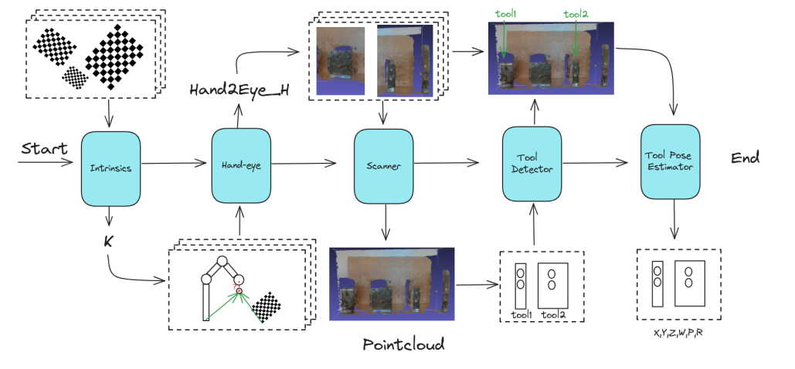

# Sherlock

Sherlock is a ROS2 and Python based pipeline which can be used to perform object pose estimation with a RGB-D camera and a robotic arm. It is not dependent by any specific hardware brand, so you can adapt it make work with tools of your choiche. 

## Project description

A high level description of the pipeline is given in the image below. More details can be found in the `docs/thesis` folder, where a comprehensive description of the inner working of each node is given

As described in the image, there are six nodes:

- **Intrinsics node**

  From a video stream, detect chessboards, use clustering to extract  representative chess poses and perform intrinsics calibration

- **Hand-eye node**

  Takes istantaneous robot transforms and RGB frames containing chessboards, perform accurate hand-eye calibration using an iterative approach

- **Scanner node**

  Takes istantaneous robot transforms and camera RGB/Depth frames, performs frames alignment and  pointcloud stitching

- **Tool detector node**

  Takes object descriptors and the previously obtained pointcloud in order to perform tool matching and coarse tool localization

- **Tool pose estimator node**

  Takes the detected tools partial pointclouds and 2D frames to precisely locate tool poses, with an iterative (even though iterations are mandatory) approach

## How to run

In order to make Sherlock work, you need Docker, which is required to use the `devcontainer` specification. After having opened the devcontainer, you can interact with the api, using ROS2.

## API

 Available topics and services are:

### Intrinsics node

List of topics:

- **/intrinsics/k**
  The estimated camera matrix K, published as a flat array of doubles
-  **/intrinsics/corners**
  The detected corners on the image. Is an Image type used for debugging and
  visualization purposes
-  **/intrinsics/state**
  The state of the node, intended as the state machine current state, serialized as
  string

List of Services

- **/intrinsics/start_recording**
  Fires  the start_recording event, and begins the data gathering
-  **/intrinsics/stop_recording**
  Fires the stop_recording event and triggers the processing phase	

### Hand-eye node

List of topics

- **/hand_eye/extrinsics**
  The estimated hand-eye homogenous transformation. The transformation is pub-
  lished as a flat array of doubles
-  **/hand_eye/state**
  The state of the node, intended as the state machine current state, serialized as
  string

List of services

- **/hand_eye/start_recording**
  Fires the start_recording event, and begins the data gathering
-  **/hand_eye/stop_recording**
  Fires the stop_recording event event and triggers the processing phase

### Scanner node

List of topics

- **/scanning/state**
  The state of the node, intended as the state machine current state, serialized as
  string
-  **/scanning/point_cloud**
  The current estimated pointcloud. This topic is active in the RECORDING state
-  **/scanning/point_cloud_stiched**
  The post-processed pointcloud, published as a Pointcloud2

List of services

-  **/scanning/start_scanning**
  Triggers the start_scanning event, which moves the node state to SCANNING
-  **/scanning/stop_scanning**
  Triggers the stop_scanning, which moves the node stat to PROCESSING

### Detector node

List of services

- **/detector/detect**
  Trigger the process event, which will move the node state to PROCESSING

### Locator node

List of services

- **/locator/locate**
  Trigger the process event, which will move the node state to PROCESSING

